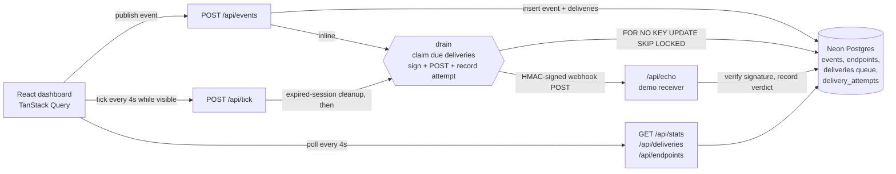

# Hookwire

Hookwire is a webhook delivery service: applications publish events through a single `POST /api/events` and Hookwire guarantees delivery to every subscribed endpoint, with HMAC signatures, exponential backoff retries and a dead-letter queue. This repository is a self-contained public demo built on a strict $0 budget: open it, send a test event, break the endpoint, watch the retries, all in under a minute.

**Live demo:** https://hookwire.vercel.app


Your demo data is isolated per browser session (anonymous cookie) and expires after 24 hours.

## Architecture



Everything runs on Vercel Functions (Node + TypeScript) and Neon Postgres, both free tier. There is no always-on process anywhere.

## Design decisions

### Postgres as the queue, not Redis or BullMQ

The queue is a `deliveries` table. A drain claims due work with:

```sql
SELECT ... FROM deliveries
WHERE status IN ('pending', 'retrying') AND (next_attempt_at IS NULL OR next_attempt_at <= now())
FOR NO KEY UPDATE SKIP LOCKED
```

`SKIP LOCKED` makes concurrent drains safe: two ticks (two open tabs, or a tick racing an inline drain) never process the same delivery twice, with no coordinator and no distributed lock. An integration test proves it by racing two pools against the same rows.

Why not Redis/BullMQ: the data already lives in Postgres, so the queue gets transactional consistency with the rows it references for free (claiming a delivery and recording its attempt commit atomically), and the free tier costs $0. A dedicated broker would add a second stateful system to operate just to serve a demo's throughput. The two locking details that matter:

- `FOR NO KEY UPDATE` instead of `FOR UPDATE`: inserting into tables that reference `deliveries` takes `FOR KEY SHARE` on the parent row. Plain `FOR UPDATE` conflicts with it, which deadlocks the drain against the echo receiver writing `echo_messages` mid-delivery.
- A partial index on `next_attempt_at WHERE status IN ('pending','retrying')` keeps the claim cheap no matter how much delivered history accumulates.

### No 24/7 worker

A real delivery service runs a worker loop. On a $0 budget there is no machine to run it, so Hookwire moves the queue forward in two moments:

1. **Inline drain**: `POST /api/events` drains the session's queue in the same request. The happy path delivers immediately with zero extra invocations.
2. **Tick**: while the dashboard tab is visible, the UI calls `POST /api/tick` every 4 seconds, which claims retries whose `next_attempt_at` is due. The frontend only calls it when the cache shows pending or retrying work, and stops when the tab is hidden.

The exact tradeoff: retry latency is tied to the tick. If nobody has the dashboard open, a due retry waits until the next visit. That is the correct cost to pay here, because the retries are precisely what the demo wants you to watch happening.

### Retry schedule

Defined in `src/lib/retry-policy.ts`, a pure module shared by the server drain and the UI countdown:

```ts
export const BACKOFF_SCHEDULE_S = [10, 30, 90, 300, 300] as const;
```

A failed attempt waits the next delay in the list before retrying.

Six attempts maximum, then the delivery is dead-lettered. The schedule is short on purpose (a demo visitor should see backoff growing within a minute), but the shape is the real thing: exponential-ish growth with a cap. Dead-lettered deliveries can be replayed from the UI; a replay keeps the real `attempt_count` history, so a replay against a still-broken endpoint goes straight back to the dead letter instead of inventing a fresh schedule.

### Stripe-style signatures

Every webhook carries:

```
X-Hookwire-Signature: t=1718200000,v1=<hex hmac-sha256>
```

where `v1` signs `"<t>.<raw_body>"` with the per-endpoint secret. The timestamp inside the signed string gives replay protection (receivers reject anything older than 5 minutes); signing the raw bytes rather than parsed JSON matters because JSON serialization is not canonical, so the receiver must verify against the exact bytes on the wire. The demo receiver (`/api/echo`) does the full verification a real subscriber would: it re-reads the raw body, recomputes the HMAC with its own copy of the secret, compares with `crypto.timingSafeEqual` (no timing oracle) and shows the verdict as the green or red badge in the echo console.

### At-least-once delivery

Hookwire retries until it sees a 2xx, so a receiver can get the same event twice: a delivery that succeeded but whose response was lost on the way back will be retried. That is at-least-once semantics, and it is the standard contract for webhooks (exactly-once across two systems that can each fail independently is not achievable without a shared transaction). The consequence is on the receiver: process webhooks idempotently, keyed by event id. Hookwire holds the same bar for itself on the publish side: the client generates the event id, and a unique constraint on `(session_id, id)` turns a retried `POST /api/events` into a no-op instead of a duplicate event. A test races the same event id from two connections at once to prove a single event and a single set of deliveries come out.

### Multi-visitor demo without auth

Each browser gets an anonymous `httpOnly` session cookie on first request. Every row carries `session_id` and every query filters by it, so visitors are fully isolated; each new session gets its own demo receiver endpoint with its own signing secret, seeded on demand. Sessions expire after 24 hours: the cookie dies and a cheap `DELETE ... WHERE created_at < now() - interval '24 hours'` at the start of each tick removes the data, with FK cascades doing the rest. No cron needed. Write endpoints (`/api/events`, `/api/replay`) are rate limited per IP with a sliding window over Postgres; exceeding it returns `429` with a `Retry-After` header, which the UI surfaces as a toast.

## Load test results (k6)

Three scenarios in [`/load-test`](load-test), run against the production deploy (results in [`/load-test/results`](load-test/results)):

| Scenario | What it does | Requests | P50 | P95 | Failures |
|---|---|---|---|---|---|
| `smoke.js` | 10 concurrent visitors polling the dashboard for 1 min | 420 | 107 ms | 217 ms | 0% |
| `delivery-flow.js` | publish + verify full inline delivery, under the rate limit | 12 events | 262 ms | 339 ms | 0% |
| `rate-limit.js` | burst of 40 events to hit the limit on purpose | 40 | n/a | n/a | 23 throttled, all with valid `Retry-After` |

Findings:

- Reads sit near 100 ms warm; the worst smoke sample (848 ms) was a cold start, the expected cost of serverless functions with no always-on process.
- The publish P95 of 339 ms includes the entire synchronous pipeline: validate, persist event and deliveries, claim, sign, POST to the receiver over the public internet and record the attempt.
- The sliding window is exact: 13 events from the previous scenario were still inside the 5-minute window, so the burst got 17 accepted before the first 429 (17 + 13 = 30, the configured limit). Every rejection carried a usable `Retry-After`.

To reproduce the 429 demo: `k6 run load-test/rate-limit.js` and watch the `events_rate_limited` counter; the same budget exhaustion shows up in the UI as a toast on the Send test event button.

## Run it locally

1. Clone and install: `git clone https://github.com/MaikelHR/Hookwire.git && cd Hookwire && npm install`
2. Create a free [Neon](https://neon.tech) Postgres project and copy its connection string.
3. `cp .env.example .env` and set `DATABASE_URL` to that connection string.
4. Apply the migrations: `npm run db:migrate`
5. Run functions and UI together: `npx vercel dev` and open the printed localhost URL.

`npm run dev` alone serves only the UI and proxies `/api` to the production deploy, which is handy for pure frontend work. `npm test` runs the pure unit tests, plus the Neon integration tests when `DATABASE_URL` is present.

## Stack

React 19 + TypeScript strict + Tailwind (Vite) | Vercel Functions | Neon Postgres (`@neondatabase/serverless`) | TanStack Query | Vitest | k6
